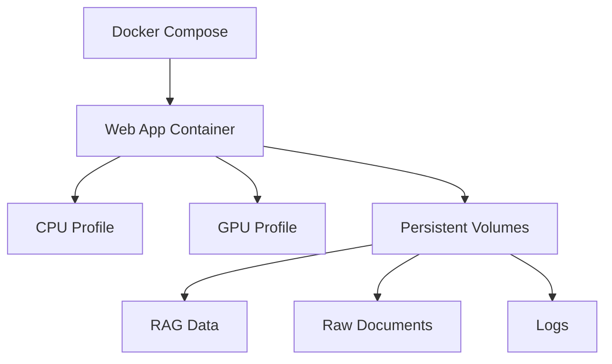

# Docker Configuration

This document details the Docker configuration for the Atlantium RAG system. For installation instructions, see our [Installation Guide](installation.md).

## Overview

The system uses Docker Compose with dual profile configuration (CPU/GPU) and persistent volume management. The deployment process automatically detects hardware capabilities and selects the appropriate profile.

## Container Architecture



## Container Profiles

### GPU Profile
```yaml
web-app-gpu:
    container_name: atlantium_llm-web-app-1
    environment:
        - PYTHONIOENCODING=utf-8
        - USE_CPU=0
        - INITIALIZE_RAG=false
    build:
        context: .
        dockerfile: Dockerfile
        args:
            - BUILD_TYPE=gpu
    deploy:
        resources:
            reservations:
                devices:
                    - driver: nvidia
                      count: all
                      capabilities: [gpu]
```

### CPU Profile
```yaml
web-app-cpu:
    container_name: atlantium_llm-web-app-1
    environment:
        - PYTHONIOENCODING=utf-8
        - USE_CPU=1
        - INITIALIZE_RAG=false
    build:
        context: .
        dockerfile: Dockerfile
        args:
            - BUILD_TYPE=cpu
```

## Volume Configuration

```yaml
volumes:
    - raw_docs:/app/Raw Documents    # Document storage
    - rag_data:/app/RAG_Data         # Index and embeddings
    - logs:/app/logs                 # System logs
    - /var/run/docker.sock:/var/run/docker.sock
    - ${HOME}/.docker/config.json:/root/.docker/config.json:ro
```

All volumes use the `local` driver for persistence:
```yaml
volumes:
    raw_docs:
        driver: local
    rag_data:
        driver: local
    logs:
        driver: local
```

## Dockerfile Structure

### Base Image
```dockerfile
FROM python:3.10-slim AS base

WORKDIR /app

# System dependencies
RUN apt-get update \
    && apt-get install -y --no-install-recommends \
        build-essential \
        python3-dev \
        netcat-traditional \
        pciutils \
    && rm -rf /var/lib/apt/lists/*

# Environment setup
ENV PYTHONUNBUFFERED=1 \
    KMP_DUPLICATE_LIB_OK=TRUE \
    PYTHONDONTWRITEBYTECODE=1 \
    PYTHONIOENCODING=utf-8
```

### Stage Selection
```dockerfile
# GPU stage
FROM base AS gpu
ENV USE_CPU=0
RUN ./install_requirements.sh

# CPU stage
FROM base AS cpu
ENV USE_CPU=1
RUN ./install_requirements.sh

# Final stage
FROM ${BUILD_TYPE:-cpu}
```

### Security Configuration
```dockerfile
# Create non-root user
RUN useradd -m -u 1000 appuser \
    && chown -R appuser:appuser /app

# Set permissions
RUN mkdir -p "RAG_Data/stored_images" "Raw Documents" logs \
    && chown -R appuser:appuser "RAG_Data" "Raw Documents" logs \
    && chmod -R 755 "RAG_Data" "Raw Documents" logs

USER appuser
```

## Deployment Process

### Hardware Detection
```bash
# Check NVIDIA drivers
if [ -f "/proc/driver/nvidia/version" ] && nvidia-smi &> /dev/null; then
    # GPU configuration
    export BUILD_TYPE=gpu
    export USE_CPU=0
    PROFILE="gpu"
else
    # CPU fallback
    export BUILD_TYPE=cpu
    export USE_CPU=1
    PROFILE="cpu"
fi
```

### Build Options
```bash
# Enable BuildKit
export DOCKER_BUILDKIT=1

# Build with no cache
docker-compose build --no-cache

# Start with profile
docker-compose --profile ${PROFILE} up -d
```

## Environment Configuration

### Required Variables
```bash
# Container configuration
CONTAINER_NAME=atlantium_llm-web-app-1
PYTHONIOENCODING=utf-8
USE_CPU=0/1
INITIALIZE_RAG=false

# Build configuration
BUILD_TYPE=gpu/cpu
DOCKER_BUILDKIT=1
```

## Common Operations

### Container Management
```bash
# View container logs
docker logs atlantium_llm-web-app-1 -f --tail=100

# Remove all containers
docker rm -f $(docker ps -a -q)

# System cleanup
docker system prune --all --volumes --force
```

### Volume Management
```bash
# List volumes
docker volume ls

# Inspect volumes
docker volume inspect raw_docs
docker volume inspect rag_data
```

### Resource Monitoring
```bash
# Monitor container resources
docker stats atlantium_llm-web-app-1

# Check GPU status (GPU profile)
docker exec atlantium_llm-web-app-1 nvidia-smi
```

## Initial Deployment

```bash
# Clone repository
git clone https://github.com/kertser/Atlantium_LLM.git
cd Atlantium_LLM

# Configure environment
cp .env.example .env

# Set execution permissions
chmod +x deploy.sh install_requirements.sh

# Deploy with initialization
./deploy.sh --init

# Access web interface
http://localhost:9000
```

## Related Documentation

- [Installation Guide](installation.md) - Setup instructions
- [Technical Reference](technical-reference.md) - System architecture
- [Update Service](update-service.md) - Automatic updates

## Troubleshooting

### Common Issues

1. **GPU Detection Failures**:
```bash
# Verify NVIDIA drivers
nvidia-smi

# Check container toolkit
nvidia-container-cli info
```

2. **Volume Persistence**:
```bash
# Check volume permissions
ls -la /var/lib/docker/volumes/

# Verify mount points
docker inspect atlantium_llm-web-app-1
```

3. **Build Failures**:
```bash
# Clean build cache
docker builder prune

# Force CPU profile
export BUILD_TYPE=cpu && ./deploy.sh
```

For additional deployment details, see our [Installation Guide](installation.md).