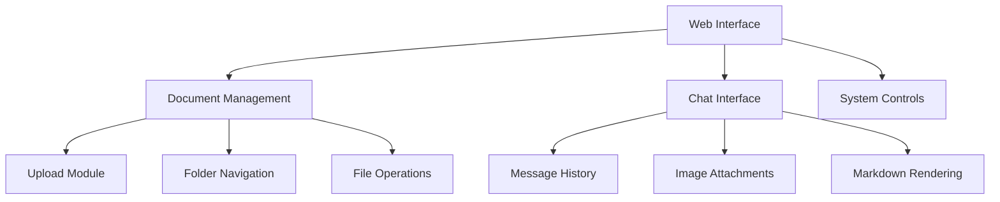

# Frontend Documentation

This document details the web interface implementation for the Atlantium RAG system. For backend details, see our [Technical Reference](technical-reference.md).

## Overview

The frontend provides an interactive web interface for document management, chat interaction, and system control. The implementation uses vanilla JavaScript for maximum compatibility and performance.

## Component Structure

### Static Files
```plaintext
static/
├── index.html     # Main application page
├── styles.css     # Application styling
├── scripts.js     # Client-side functionality
└── favicon.png    # Application icon
```

### Interface Components



## Implementation Details

### 1. Document Management

#### Upload Interface
```javascript
async function uploadDocument(file) {
    const formData = new FormData();
    formData.append('file', file);
    formData.append('folder', currentFolderPath);

    try {
        const response = await fetch('/upload/document', {
            method: 'POST',
            body: formData
        });
        
        if (!response.ok) {
            throw new Error(`Upload failed: ${response.statusText}`);
        }
        
        return await response.json();
    } catch (error) {
        console.error('Upload error:', error);
        throw error;
    }
}
```

For document processing details, see our [Technical Reference](technical-reference.md#document-processing).

#### Folder Navigation
```javascript
async function loadDocuments(path = '') {
    try {
        const response = await fetch(`/get/documents?path=${encodeURIComponent(path)}`);
        const data = await response.json();
        
        updateDocumentList(data.files, data.folders);
        updateBreadcrumbs(data.current_path);
        
    } catch (error) {
        console.error('Error loading documents:', error);
    }
}
```

### 2. Chat Interface

#### Message Formatting
```javascript
function formatMessageText(text) {
    // Process markdown
    text = text.replace(/^# (.+)$/gm, '<h3 class="message-header">$1</h3>');
    text = text.replace(/\*\*(.+?)\*\*/g, '<strong>$1</strong>');
    
    // Process math content
    text = processMathContent(text);
    
    // Format lists
    text = formatLists(text);
    
    return text;
}
```

For prompt handling details, see our [Models Documentation](models.md#prompt-templates).

#### Message Handler
```javascript
async function handleSend() {
    const message = input.value.trim();
    const attachment = currentAttachedImage;

    if (message || attachment) {
        addMessage({ text: message, image: attachment }, true);
        
        const response = await sendMessageWithImage(message, attachment);
        addMessage(response, false);
    }
}
```

### 3. System Controls

#### Document Processing
```javascript
async function processDocuments() {
    try {
        const response = await fetch('/process/documents', {
            method: 'POST'
        });
        
        if (!response.ok) {
            throw new Error('Processing failed');
        }
        
        await loadDocuments(currentFolderPath);
        
    } catch (error) {
        console.error('Processing error:', error);
    }
}
```

For update procedures, see our [Update Service Guide](update-service.md).

## API Integration

### Document Endpoints
- POST `/upload/document` - Upload new document
- GET `/get/documents` - List documents and folders
- POST `/process/documents` - Process uploaded documents
- DELETE `/delete/document` - Remove document

For complete API details, see our [Technical Reference](technical-reference.md#api-endpoints).

### Query Endpoints
- POST `/query/text` - Process text queries
- POST `/query/image` - Process image queries
- POST `/chat/reset` - Reset chat history
- GET `/chat/history` - Get chat history

## Styling Guide

### Component Classes
```css
.message {
    /* Message container */
    padding: 1.25rem;
    border-radius: var(--border-radius);
    max-width: 85%;
}

.user-message {
    /* User message styling */
    background-color: #EBF5FF;
    align-self: flex-end;
}

.assistant-message {
    /* Assistant message styling */
    background-color: #F8F9FA;
    align-self: flex-start;
}
```

### Theme Variables
```css
:root {
    --primary-color: #4A90E2;
    --background-color: #F8F9FA;
    --text-color: #2C3E50;
    --border-radius: 12px;
    --shadow: 0 4px 6px rgba(0, 0, 0, 0.1);
}
```

## Event Handling

### Document Events
```javascript
// File drop handling
dropZone.addEventListener('drop', handleDrop);
dropZone.addEventListener('dragover', preventDefault);

// Upload button
uploadButton.addEventListener('click', () => fileInput.click());

// Process button
processButton.addEventListener('click', processDocuments);
```

### Chat Events
```javascript
// Message submission
sendButton.addEventListener('click', handleSend);
input.addEventListener('keydown', handleKeyPress);

// Image attachment
attachButton.addEventListener('click', () => imageInput.click());
imageInput.addEventListener('change', handleImageAttachment);
```

## Error Handling

### Client-Side Validation
```javascript
function validateFile(file) {
    const validTypes = ['.pdf', '.docx', '.xlsx'];
    const maxSize = 10 * 1024 * 1024; // 10MB

    if (!validTypes.some(type => file.name.toLowerCase().endsWith(type))) {
        throw new Error('Invalid file type');
    }

    if (file.size > maxSize) {
        throw new Error('File too large');
    }
}
```

### Error Display
```javascript
function showError(message, duration = 5000) {
    const errorDiv = document.createElement('div');
    errorDiv.className = 'error-message';
    errorDiv.textContent = message;
    
    document.body.appendChild(errorDiv);
    setTimeout(() => errorDiv.remove(), duration);
}
```

## Performance Optimization

1. **Image Handling**:
   - Client-side image compression
   - Lazy loading for images
   - Base64 caching

2. **Event Debouncing**:
   - Input throttling
   - Scroll optimization
   - Resize handling

3. **Resource Loading**:
   - Deferred script loading
   - Style optimization
   - Asset caching

## Related Documentation

- [Technical Reference](technical-reference.md) - Backend implementation
- [Models Documentation](models.md) - AI model integration
- [Utils Documentation](utils.md) - Utility functions
- [Installation Guide](installation.md) - Setup instructions
- [Update Service](update-service.md) - System updates

## Support

For frontend-related issues:
1. Check browser console for errors
2. Verify network requests
3. Ensure proper file permissions
4. Contact [Mike Kertser](mailto:mikek@atlantium.com)