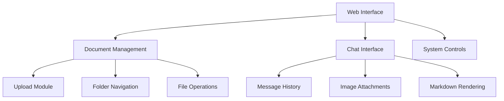

# Frontend Documentation

This document details the web interface implementation for the Atlantium RAG system. For backend details, see our [Technical Reference](technical-reference.md).

## Overview

The frontend provides an interactive web interface for document management, chat interaction, and system control. The implementation uses vanilla JavaScript for maximum compatibility and performance.

## Component Structure

### Static Files
```plaintext
static/
├── index.html     # Main application page
├── styles.css     # Application styling
├── scripts.js     # Client-side functionality
└── favicon.png    # Application icon
```

### Interface Components


## API Integration

### Document Endpoints
- POST `/upload/document` - Upload new document
- GET `/get/documents` - List documents and folders
- POST `/process/documents` - Process uploaded documents
- DELETE `/delete/document` - Remove document

For complete API details, see our [Technical Reference](technical-reference.md#api-endpoints).

### Query Endpoints
- POST `/query/text` - Process text queries
- POST `/query/image` - Process image queries
- POST `/chat/reset` - Reset chat history
- GET `/chat/history` - Get chat history

## Related Documentation

- [Technical Reference](technical-reference.md) - Backend implementation
- [Models Documentation](models.md) - AI model integration
- [Utils Documentation](utils.md) - Utility functions
- [Installation Guide](installation.md) - Setup instructions
- [Update Service](update-service.md) - System updates

## Support

For frontend-related issues:
1. Check browser console for errors
2. Verify network requests
3. Ensure proper file permissions
4. Contact [Mike Kertser](mailto:mikek@atlantium.com)