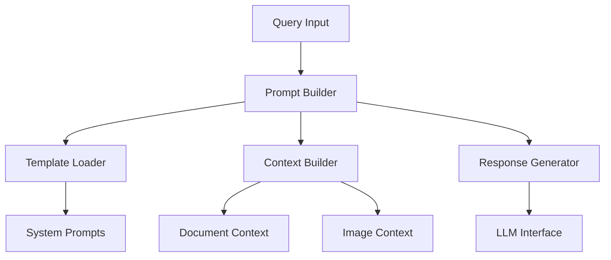

# Models Documentation

This document details the AI model implementations and prompt handling systems. For system architecture overview, see our [Technical Reference](technical-reference.md).

## Overview

The models package handles AI model management, prompt engineering, and response generation. It integrates CLIP for multimodal embeddings and interfaces with OpenAI's GPT models, providing context-aware responses for UV system queries.

## System Architecture



## Core Components

### Prompt Manager:
- Loads and formats prompt templates
- Manages system configuration prompts
- Handles prompt generation
- Manages error handling templates
- Manages response templates

### Response Generator:
- Formats and structures response content
- Handles error responses
- Manages response generation
- Manages technical response formatting

### Context Builder:
- Extracts relevant information from documents
- Generates context for AI models
- Manages document processing
- Manages image processing
- Manages image context generation
- Manages document context generation

### LLM Interface:
- Communicates with OpenAI's GPT (Or different) model
- Handles response generation

## Prompt Templates (`templates/prompts.yaml`)

### System Configuration
```yaml
system:
  technical_assistant: |
  vision_assistant: |
```

### Response Templates
```yaml
templates:
  chat_prompt: |
  technical_response: |
```

### Error Handling
```yaml
error_handling:
  insufficient_data: |
```

## Future Development

1. **Model Improvements**:
   - Fine-tuned UV domain-related models
   - Enhanced context understanding
   - Improved technical validation

2. **Template Extensions**:
   - Additional response formats
   - Enhanced error handling
   - Domain-specific templates

3. **Integration Enhancements**:
   - Additional model support
   - Enhanced multimodal processing
   - Improved context management

## Related Documentation

- [Technical Reference](technical-reference.md) - System architecture
- [Frontend Documentation](frontend.md) - Web interface
- [Utils Documentation](utils.md) - Utility functions
- [Installation Guide](installation.md) - Setup instructions
- [Update Service](update-service.md) - System updates

## Support

For AI model-related issues:
1. Check system logs for errors
2. Verify API configurations
3. Ensure proper model initialization
4. Contact [Mike Kertser](mailto:mikek@atlantium.com)