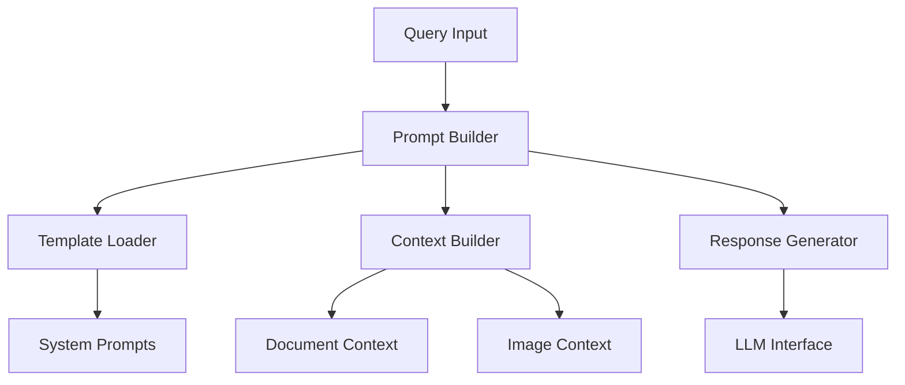

# Models Documentation

This document details the AI model implementations and prompt handling systems. For system architecture overview, see our [Technical Reference](technical-reference.md).

## Overview

The models package handles AI model management, prompt engineering, and response generation. It integrates CLIP for multimodal embeddings and interfaces with OpenAI's GPT models, providing context-aware responses for UV system queries.

## System Architecture



## Core Components

### 1. PromptLoader (`prompt_loader.py`)

Manages system prompts and instruction templates. For implementation details, see our [Technical Reference](technical-reference.md#core-components).

```python
class PromptLoader:
    def __init__(self):
        """Initialize prompt templates from YAML."""
        self._load_prompts()

    def get_system_prompt(self, key: str) -> str:
        """Get system-level prompts."""
        return self._prompts.get('system', {}).get(key, '')

    def get_instructions(self, instruction_type: str) -> List[str]:
        """Get instruction sets by type."""
        return self._prompts.get('instructions', {}).get(instruction_type, [])

    def get_template(self, key: str) -> str:
        """Get prompt templates."""
        return self._prompts.get('templates', {}).get(key, '')

    def format_template(self, template_key: str, **kwargs) -> str:
        """Format a template with variables."""
```

### 2. PromptBuilder (`prompts.py`)

Constructs context-aware prompts for different query types. For frontend integration, see our [Frontend Documentation](frontend.md#chat-interface).

```python
class PromptBuilder:
    def build_chat_prompt(
        self,
        query_text: str,
        contexts: List[str],
        images: List[Dict],
        chat_history: List[Dict],
        is_technical: bool = False
    ) -> str:
        """Build complete prompt with context."""
        
    def build_messages(self, prompt: str) -> List[Dict[str, str]]:
        """Convert prompt to message format."""
```

## Prompt Templates (`templates/prompts.yaml`)

### System Configuration
```yaml
system:
  technical_assistant: |
    You are Atlantium Technologies' technical documentation assistant.
    Focus on UV systems and technical accuracy.
    Follow these principles:
    1. Use validated information
    2. Express uncertainty clearly
    3. Cross-reference documentation
    4. Maintain technical precision

  vision_assistant: |
    Analyze technical diagrams and specifications.
    Focus on UV system components and relationships.
```

### Response Templates
```yaml
templates:
  chat_prompt: |
    Query Context:
    {query_text}
    
    Available Documentation:
    {context_text}
    
    Visual Information:
    {image_context}
    
    Response Guidelines:
    {instructions}

  technical_response: |
    ## Technical Analysis
    {analysis}
    
    ## Specifications
    {specifications}
    
    ## Application
    {application}
```

### Error Handling
```yaml
error_handling:
  insufficient_data: |
    I apologize, but I don't have enough information to answer about:
    {query}
    
    Missing Information:
    - {missing_details}
    
    Suggested Actions:
    1. {action_1}
    2. {action_2}
```

## Usage Examples

### 1. Building Chat Prompts
```python
from models.prompts import PromptBuilder

builder = PromptBuilder()
prompt = builder.build_chat_prompt(
    query_text="How does UV disinfection work?",
    contexts=relevant_docs,
    images=relevant_images,
    chat_history=[]
)
```

### 2. Loading System Prompts
```python
from models.prompt_loader import PromptLoader

loader = PromptLoader()
system_prompt = loader.get_system_prompt('technical_assistant')
```

### 3. Template Formatting
```python
formatted = loader.format_template(
    'technical_response',
    analysis="UV disinfection uses...",
    specifications="Wavelength: 254nm...",
    application="Common uses include..."
)
```

## Integration Points

### 1. CLIP Integration
```python
from utils.LLM_utils import CLIP_init

model, processor = CLIP_init(CONFIG.CLIP_MODEL_NAME)
embeddings = encode_with_clip(texts, images, model, processor)
```

For utility functions, see our [Utils Documentation](utils.md).

### 2. LLM Integration
```python
response = openai_post_request(
    messages=messages,
    model_name=CONFIG.GPT_MODEL,
    max_tokens=CONFIG.MAX_TOKENS,
    temperature=CONFIG.TEMPERATURE
)
```

### 3. Document Processing
For document handling details, see our [Technical Reference](technical-reference.md#document-processing).

## Validation Rules

### Content Validation
```yaml
validation_rules:
  content:
    max_length: 10000
    min_length: 10
    required_sections: ["overview", "details", "conclusion"]

  technical:
    units_required: true
    range_validation: true
    safety_notes: true
```

## Response Formatting

### 1. Technical Responses
```python
def format_technical_response(content: str) -> str:
    """Format technical response with proper structure."""
    sections = [
        "## Overview",
        "## Technical Details",
        "## Specifications",
        "## Application",
        "## Safety Notes"
    ]
```

### 2. Error Responses
```python
def format_error_response(error_type: str, details: Dict) -> str:
    """Format error responses with helpful information."""
```

## Future Development

1. **Model Improvements**:
   - Fine-tuned UV domain models
   - Enhanced context understanding
   - Improved technical validation

2. **Template Extensions**:
   - Additional response formats
   - Enhanced error handling
   - Domain-specific templates

3. **Integration Enhancements**:
   - Additional model support
   - Enhanced multimodal processing
   - Improved context management

## Related Documentation

- [Technical Reference](technical-reference.md) - System architecture
- [Frontend Documentation](frontend.md) - Web interface
- [Utils Documentation](utils.md) - Utility functions
- [Installation Guide](installation.md) - Setup instructions
- [Update Service](update-service.md) - System updates

## Support

For AI model-related issues:
1. Check system logs for errors
2. Verify API configurations
3. Ensure proper model initialization
4. Contact [Mike Kertser](mailto:mikek@atlantium.com)