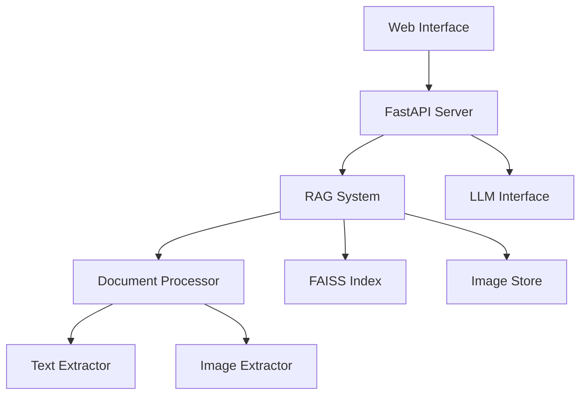
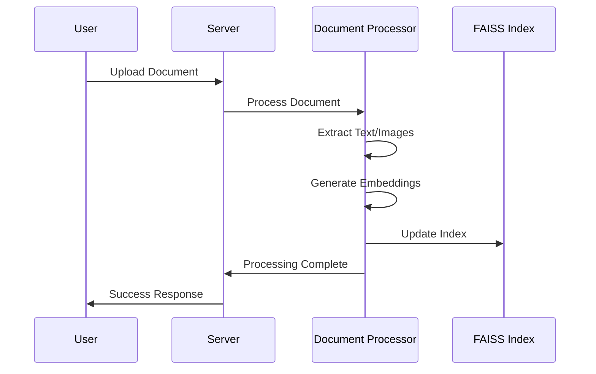
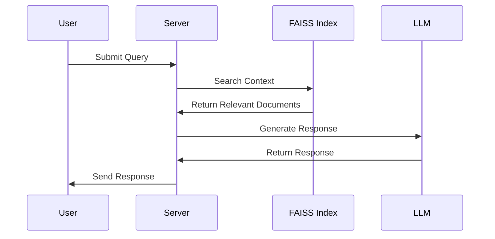

# Technical Reference Documentation

## System Overview

The Atlantium LLM system is a Retrieval-Augmented Generation (RAG) platform that combines document processing, vector embeddings, and language models to provide technical assistance for UV systems.

### Architecture Overview



## Directory Structure

```
Atlantium_LLM/
├── config.py                   # System configuration
├── server.py                   # FastAPI server implementation
├── RAG_processor.py            # Document processing engine
├── run.py                      # Server runner
├── docker/                     # Container configuration
│   ├── Dockerfile              # Container build instructions
│   └── docker-compose.yaml     # Service orchestration
├── scripts/
│   ├── docker-entrypoint.sh    # Container entry point
│   ├── install_requirements.sh # Dependency installation
│   └── update_rag.sh           # RAG system updater
├── models/                     # AI model components
│   ├── prompt_loader.py        # Template management
│   ├── prompts.py              # Prompt construction
│   └── templates/
│       └── prompts.yaml        # System prompts
├── utils/                      # Utility modules
│   ├── FAISS_utils.py          # Vector operations
│   ├── image_utils.py          # Image processing
│   ├── LLM_utils.py            # LLM integration
│   ├── RAG_utils.py            # Document processing
│   ├── document_utils.py       # File operations
│   └── image_store.py          # Image management
├── static/                     # Frontend assets
│   ├── index.html              # Web interface
│   ├── styles.css              # UI styling
│   ├── scripts.js              # Client-side logic
│   └── favicon.png             # Site icon
├── RAG_Data/                   # Generated data
│   ├── stored_images/          # Processed images
│   ├── stored_text_chunks/     # Text segments
│   ├── faiss_index.bin         # Vector index
│   └── metadata.json           # Index metadata
├── Raw Documents/              # Source documents
└── logs/                       # System logs
    └── system.log              # Main log file
```

## Core Components

### 1. Server Implementation (server.py)

#### RAGQueryServer
Primary server class managing query processing and response generation.

```python
class RAGQueryServer:
    def __init__(self):
        """Initialize server with CLIP model, FAISS index, and image store."""
        self.openai_api_key = os.getenv("OPENAI_API_KEY")
        self.model, self.processor, self.device = CLIP_init(CONFIG.CLIP_MODEL_NAME)
        self.index = load_faiss_index(CONFIG.FAISS_INDEX_PATH)
        self.image_store = ImageStore(CONFIG.STORED_IMAGES_PATH)

    async def process_text_query(
        self, 
        query_text: str, 
        top_k: int = CONFIG.DEFAULT_TOP_K
    ) -> QueryResponse:
        """Process text queries with context retrieval."""

    async def process_image_query(
        self, 
        image_data: bytes, 
        query_text: Optional[str] = None
    ) -> str:
        """Process image-based queries."""
```

### 2. Document Processing (RAG_processor.py)

Handles document ingestion and processing:

```python
def process_documents(
    model, 
    processor, 
    device, 
    index, 
    metadata, 
    image_store, 
    doc_paths=None
) -> Tuple[faiss.Index, List[Dict]]:
    """
    Process documents to extract text and images, generate embeddings,
    and update FAISS index.
    
    Args:
        model: CLIP model instance
        processor: CLIP processor
        device: Computing device (CPU/GPU)
        index: FAISS index
        metadata: Index metadata
        image_store: ImageStore instance
        doc_paths: Optional list of document paths
        
    Returns:
        Updated index and metadata
    """
```

### 3. Vector Operations (FAISS_utils.py)

FAISS index management and vector operations:

```python
def initialize_faiss_index(
    dimension: int = CONFIG.EMBEDDING_DIMENSION,
    use_gpu: bool = CONFIG.USE_GPU
) -> faiss.Index:
    """Initialize FAISS index with optional GPU support."""
    
def add_to_faiss(
    embedding: np.ndarray,
    source_file_name: str,
    content_type: str,
    content: Dict,
    index: faiss.Index,
    metadata: List[Dict],
    processed_ids: Set[str] = None
) -> bool:
    """Add embedding to FAISS index with metadata."""
```

### 4. Image Processing (image_utils.py)

Image analysis and processing utilities:

```python
def zero_shot_classification(
    image: Union[Image.Image, str],
    labels: List[str],
    model: Any,
    processor: Any,
    device: str
) -> Tuple[str, float]:
    """Classify images using CLIP zero-shot classification."""

def deduplicate_images(
    images: List[Dict],
    max_images: int = 8
) -> List[Dict]:
    """Remove duplicate images using perceptual hashing."""
```

## API Endpoints

### Document Management

#### Upload Document
```http
POST /upload/document
Content-Type: multipart/form-data

Parameters:
- file: File (PDF, DOCX, XLSX)
- folder: string (optional)

Response:
{
    "status": "success",
    "path": "path/to/document"
}
```

#### Process Documents
```http
POST /process/documents

Response:
{
    "status": "success"
}
```

### Query Processing

#### Text Query
```http
POST /query/text
Content-Type: application/x-www-form-urlencoded

Parameters:
- query: string

Response:
{
    "status": "success",
    "response": {
        "text_response": string,
        "images": [
            {
                "image": string (base64),
                "caption": string,
                "context": string,
                "source": string,
                "similarity": float
            }
        ]
    }
}
```

#### Image Query
```http
POST /query/image
Content-Type: multipart/form-data

Parameters:
- image: File
- query: string (optional)

Response:
{
    "response": string
}
```

## Configuration

### Environment Variables (.env)
```plaintext
OPENAI_API_KEY=your_api_key_here
CONTAINER_NAME=atlantium_llm-web-app-1
USE_CPU=0
GITHUB_WEBHOOK_SECRET=your_webhook_secret
```

## Data Flow

### 1. Document Processing Flow


### 2. Query Processing Flow


## Performance Optimization

### 1. Batch Processing
- Configure optimal batch size in config.py
- Monitor memory usage during processing
- Adjust based on available resources

### 2. GPU Utilization
- Enable GPU support when available
- Monitor GPU memory usage
- Implement proper cleanup

### 3. Index Optimization
- Regular index maintenance
- Periodic cleanup of unused vectors
- Optimal chunk size configuration

## Monitoring and Logging

### Log Configuration
```python
logging.basicConfig(
    level=logging.INFO,
    format='%(asctime)s - %(levelname)s: %(message)s',
    handlers=[
        logging.FileHandler(CONFIG.LOG_PATH/"system.log"),
        logging.StreamHandler(sys.stdout)
    ]
)
```

## Support and Maintenance

### System Updates
- Regular dependency updates
- Security patches
- Performance optimizations
- Bug fixes

### Backup Procedures
- Regular index backups
- Document backups
- Configuration backups
- Log rotation

For additional support, contact [Atlantium Technologies Support](mailto:support@atlantium.com).
