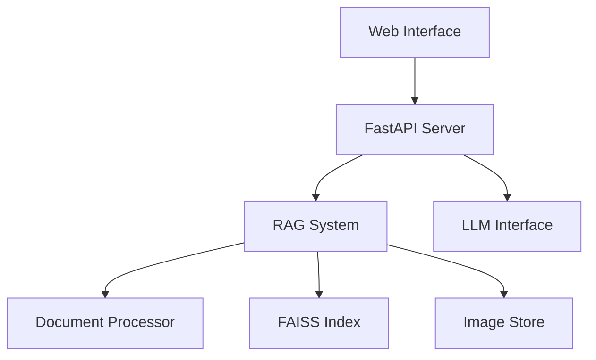

# Technical Reference

## System Architecture

The Atlantium LLM system combines document processing, vector embeddings, and language models to provide advanced technical assistance for UV systems.

### Core Components


```mermaid
graph TD
    A[Web Interface] --> B[FastAPI Server]
    B --> C[RAG System]
    C --> D[Document Processor]
    C --> E[FAISS Index]
    C --> F[Image Store]
    B --> G[LLM Interface]
```

### Project Structure

```plaintext
Atlantium_LLM/                        # Project root
├── docs/                             # Documentation files
│   ├── docker.md                     # Docker configuration guide
│   ├── frontend.md                   # Frontend implementation details
│   ├── installation.md               # Installation instructions
│   ├── models.md                     # AI models documentation
│   ├── technical-reference.md        # Technical system details
│   ├── update-service.md             # Update service guide
│   └── utils.md                      # Utilities documentation
├── logs/                             # System logs directory
├── models/                           # AI models package
│   ├── __init__.py
│   ├── prompt_manager.py             # Prompt management
│   └── templates/
│       └── prompts.yaml              # System prompts
├── RAG_Data/                         # Generated by RAG system
│   ├── faiss_index.bin               # Vector database
│   ├── faiss_metadata.json           # Index metadata
│   ├── image_metadata.json           # Image metadata
│   ├── processed_files.json          # Processing tracking
│   ├── stored_images/                # Processed images
│   └── stored_text_chunks/           # Processed text
├── Raw Documents/                    # Document storage
├── scripts/                          # System scripts
│   ├── update_service/               # Update system
│   │   ├── atlantium-update.service  # Systemd service
│   │   ├── install.sh                # Service installer
│   │   └── release_update.sh         # Update script
│   ├── docker-entrypoint.sh          # Container entry
│   └── install_requirements.sh       # Dependency installer
├── static/                           # Frontend assets
│   ├── favicon.png                   # Site icon
│   ├── index.html                    # Main page
│   ├── logo_long.jpg                 # Logo image
│   ├── scripts.js                    # Frontend logic
│   └── styles.css                    # Styling
├── utils/                            # Utility package
│   ├── __init__.py
│   ├── document_utils.py             # Document operations
│   ├── FAISS_utils.py                # Vector operations
│   ├── img_utils.py                  # Image processing
│   ├── initialize_RAG.py             # RAG initialization
│   ├── LLM_utils.py                  # Model integration
│   └── RAG_utils.py                  # RAG operations
├── .env                              # Environment configuration
├── .dockerignore                     # Docker exclusions
├── config.py                         # System configuration
├── deploy.sh                         # Deployment script
├── docker-compose.yaml               # Container orchestration
├── Dockerfile                        # Container definition
├── RAG_processor.py                  # Document processor
├── README.md                         # Project documentation
├── requirements_cpu.txt              # CPU dependencies
├── requirements_gpu.txt              # GPU dependencies
├── run.py                            # Server runner
└── server.py                         # FastAPI server
```

## API Documentation

### Server Endpoints

#### Document Management
```http
POST /upload/document
Content-Type: multipart/form-data
Parameters:
- file: File (PDF, DOCX, XLSX)
- folder: string (optional)
Response: {
    "status": "success",
    "path": "relative_path"
}

POST /process/documents
Response: {
    "status": "success"
}

GET /get/documents?path={encoded_path}
Response: {
    "current_path": string,
    "folders": array,
    "files": array,
    "total_processed": number
}

DELETE /delete/document?path={encoded_path}
Response: {
    "status": "success",
    "message": string
}
```

#### Query Processing
```http
POST /query/text
Content-Type: application/x-www-form-urlencoded
Parameters:
- query: string
Response: {
    "status": "success",
    "response": {
        "text_response": string,
        "images": array
    }
}

POST /query/image
Content-Type: multipart/form-data
Parameters:
- image: File
- query: string (optional)
Response: {
    "response": string
}

POST /chat/reset
Response: {
    "status": "success",
    "message": string
}

GET /chat/history
Response: {
    "history": array
}
```

#### Folder Management
```http
POST /folder/create
Content-Type: application/json
Body: {
    "parent_path": string,
    "folder_name": string
}

DELETE /folder/delete?path={encoded_path}
Response: {
    "status": "success",
    "message": string,
    "errors": array|null
}

PUT /folder/rename
Content-Type: application/json
Body: {
    "path": string,
    "new_name": string
}
```

## Core Classes

### RAGQueryServer
Main server class handling query processing and responses.
```python
class RAGQueryServer:
    def __init__(self)
    async def process_text_query(self, query: str, top_k: int = CONFIG.DEFAULT_TOP_K)
    async def process_image_query(self, image_data: bytes, query_text: Optional[str] = None)
    def reset_chat(self)
    def get_chat_history(self)
```

### ImageProcessor
Base class for image processing operations.
```python
class ImageProcessor:
    @staticmethod
    def convert_to_rgb(image: Image.Image) -> Image.Image
    @staticmethod
    def calculate_hash(image: Union[Image.Image, str, bytes]) -> Optional[str]
    @staticmethod
    def compare_hashes(hash1: str, hash2: str, threshold: float) -> bool
```

### ImageStore
Handles image storage, retrieval, and deduplication.
```python
class ImageStore(ImageProcessor):
    def __init__(self)
    def store_image(self, image: Image.Image, source_doc: str, page_num: int,
                   caption: Optional[str] = None, context: Optional[str] = None) -> str
    def get_image(self, image_id: str) -> Tuple[Optional[Image.Image], Optional[Dict]]
    def get_base64(self, image_id: str) -> Optional[str]
    def delete_image(self, image_id: str) -> bool
```

### PromptBuilder
Handles prompt generation and management.
```python
class PromptBuilder:
    def __init__(self)
    def build_chat_prompt(self, query_text: str, contexts: List[str],
                         images: List[Dict], chat_history: List[Dict],
                         is_technical: bool = False) -> str
    def build_messages(self, prompt: str) -> List[Dict[str, str]]
```

## Key Functions

### FAISS Operations
```python
def initialize_faiss_index(dimension: int, use_gpu: bool = False) -> faiss.Index
def load_faiss_index(filepath: Union[str, Path]) -> faiss.Index
```

