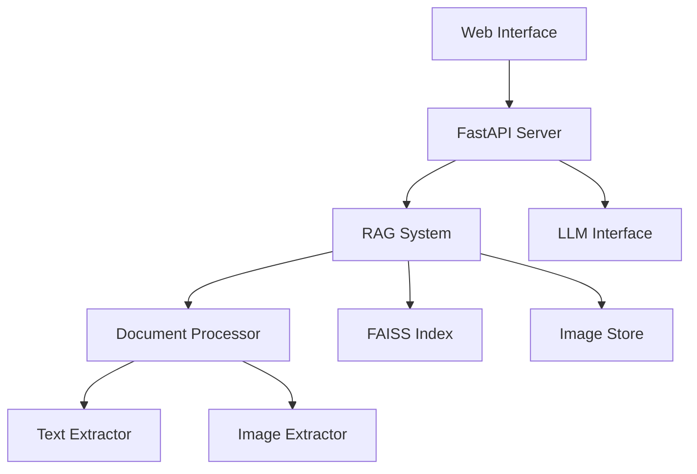
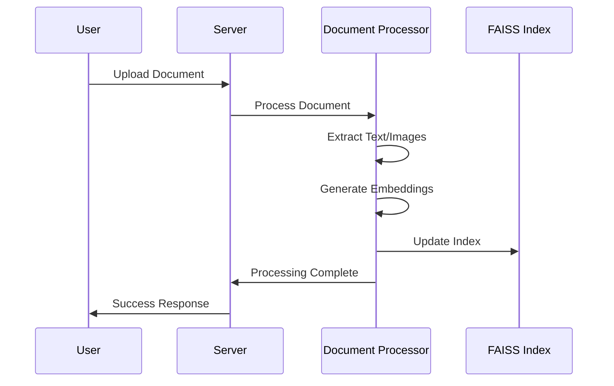
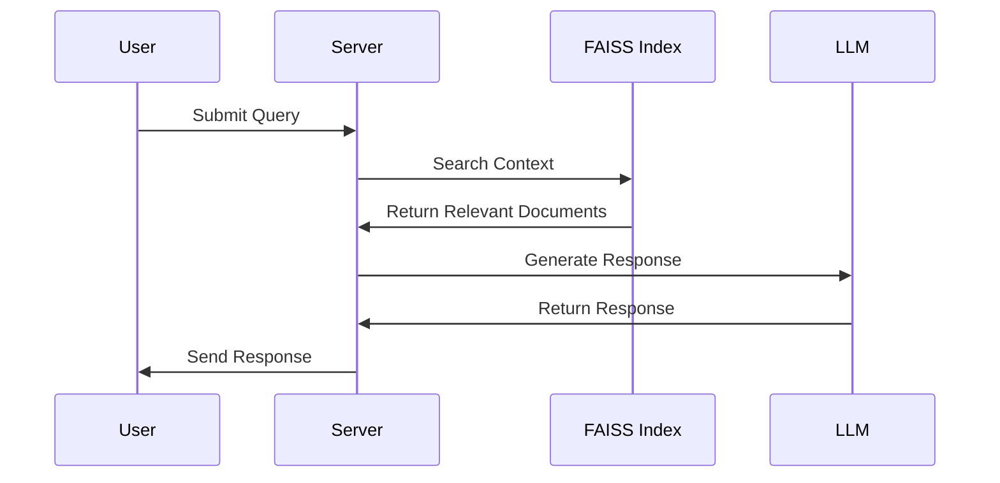

# Technical Reference

This document provides comprehensive technical details about the Atlantium RAG system. For basic setup, see our [Installation Guide](installation.md).

## System Overview

The Atlantium LLM system is a Retrieval-Augmented Generation (RAG) platform that combines document processing, vector embeddings, and language models to provide technical assistance for UV systems. For user interface details, see our [Frontend Documentation](frontend.md).

### Architecture Diagram


```mermaid
graph TD
    A[Web Interface] --> B[FastAPI Server]
    B --> C[RAG System]
    C --> D[Document Processor]
    C --> E[FAISS Index]
    C --> F[Image Store]
    B --> G[LLM Interface]
    D --> H[Text Extractor]
    D --> I[Image Extractor]
```

## Directory Structure

```plaintext
Core Directory Structure:
-------------------------
Atlantium_LLM/
├── config.py                  # System configuration
├── server.py                  # FastAPI server
├── RAG_processor.py           # Document processor
├── run.py                     # Server runner
├── scripts/
│   ├── update_service/        # Update system components
│   ├── docker-entrypoint.sh   # Container entry
│   └── install_requirements.sh # Dependencies
├── models/                    # AI model components:
│   ├── prompt_manager.py      # Prompt Manager
│   └── templates/
│       └── prompts.yaml       # System prompts
├── utils/                     # Utility modules
│   ├── FAISS_utils.py         # Vector operations
│   ├── LLM_utils.py           # LLM integration
│   ├── RAG_utils.py           # Document processing
│   ├── document_utils.py      # File operations
│   └── img_utils.py           # Image management
├── static/                    # Frontend assets:
│   ├── index.html             # Web interface
│   ├── styles.css             # UI styling
│   └── scripts.js             # Client logic
└── docs/                      # Documentation:
    ├── installation.md        # Setup guide
    ├── update-service.md      # Update system
    ├── frontend.md            # UI documentation
    ├── models.md              # AI model details
    └── utils.md               # Utilities guide

Additional File Structure:
--------------------------
├──deploy.sh                   # Deployment script    
├──logs/                       # System logs
├──Raw_Documents/              # Document storage
├──RAG_Data/                   # Document processing data
└──scripts/                    # System scripts
   ├── docker-entrypoint.sh    # Container entry
   ├── install_requirements.sh # Dependency installer
   └── update_service/         # Update service components
      ├── atlantium-update.service  # Update service
      ├── install.sh                # Service installation script
      └── release_update.sh         # Update script

```

## Core Components

### 1. Server Implementation

The FastAPI server ([server.py](../server.py)) manages query processing and response generation. For frontend details, see our [Frontend Documentation](frontend.md).

```python
class RAGQueryServer:
    def __init__(self):
    async def process_text_query()
    async def process_image_query()
```

### 2. Document Processing

The RAG processor ([RAG_processor.py](../RAG_processor.py)) handles document ingestion and processing. For update procedures, see our [Update Service Guide](update-service.md).

### 3. Utility Functions

For comprehensive utilities documentation, see our [Utils Documentation](utils.md).
## API Endpoints

### Document Management

```http
POST /upload/document
Content-Type: multipart/form-data

Parameters:
- file: File (PDF, DOCX, XLSX)
- folder: string (optional)
```

```http
POST /process/documents

Response: {
    "status": "success"
}
```

### Query Processing

```http
POST /query/text
Content-Type: application/x-www-form-urlencoded

Parameters:
- query: string
```

```http
POST /query/image
Content-Type: multipart/form-data

Parameters:
- image: File
- query: string (optional)
```

## Data Flow

### 1. Document Processing

```mermaid
sequenceDiagram
    participant U as User
    participant S as Server
    participant D as Document Processor
    participant I as FAISS Index
    
    U->>S: Upload Document
    S->>D: Process Document
    D->>D: Extract Text/Images
    D->>D: Generate Embeddings
    D->>I: Update Index
    D->>S: Processing Complete
    S->>U: Success Response
```

### 2. Query Processing

```mermaid
sequenceDiagram
    participant U as User
    participant S as Server
    participant I as FAISS Index
    participant L as LLM

    U->>S: Submit Query
    S->>I: Search Context
    I->>S: Return Relevant Documents
    S->>L: Generate Response
    L->>S: Return Response
    S->>U: Send Response
```
## Troubleshooting Guide

### Common Issues

1. Memory Management:
   - Monitor resource usage
   - Adjust batch sizes
   - Implement cleanup routines

2. GPU Utilization:
   - Check NVIDIA drivers
   - Monitor GPU memory
   - Handle OOM errors

3. Index Maintenance:
   - Regular optimization
   - Error handling
   - Backup procedures

For installation-related issues, see our [Installation Guide](installation.md#troubleshooting).

## Related Documentation

- [Installation Guide](installation.md) - Setup instructions
- [Update Service Guide](update-service.md) - Automatic updates
- [Frontend Documentation](frontend.md) - Web interface
- [Models Documentation](models.md) - AI components
- [Utils Documentation](utils.md) - Utility functions

## Support

For technical support, contact [Mike Kertser](mailto:mikek@atlantium.com).