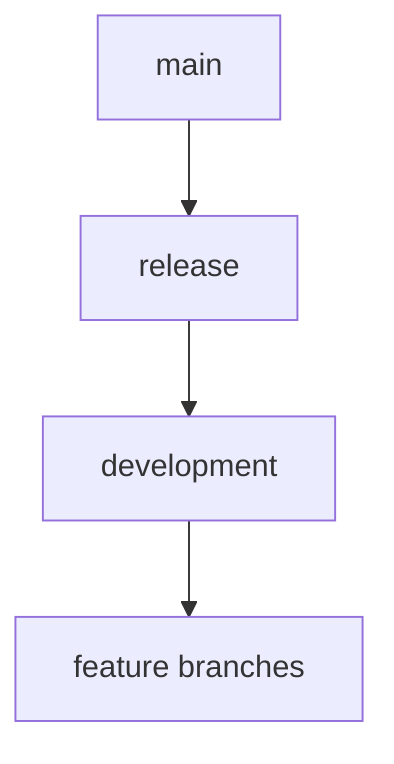

# Update Service Guide

This guide explains the automated update system for the Atlantium RAG application. For initial setup, see our [Installation Guide](installation.md).

## Overview

The update service automatically monitors the GitHub release branch for new versions and updates your installation while preserving all data. It integrates with the [Docker-based deployment](docker.md) and maintains data persistence.

## Branch Structure



- `development`: Active development - new features start here
- `release`: Staging and testing
- `main`: Production code

## For Developers

### Development Workflow

1. **Start New Feature**:
```bash
# Update development branch
git checkout development
git pull origin development

# Create feature branch
git checkout -b feature/your-feature
```

2. **Implement Changes**:
```bash
# Make changes
git add .
git commit -m "Description of changes"

# Push to GitHub
git push origin feature/your-feature
```

3. **Create Release**:
```bash
# Update development
git checkout development
git pull origin development

# Update release branch
git checkout release
git pull origin release
git merge development

# Create and push tag
git tag v1.0.1
git push origin release
git push origin v1.0.1
```

### Version Tagging
Use semantic versioning: `vMAJOR.MINOR.PATCH`
- MAJOR: Breaking changes
- MINOR: New features (backward compatible)
- PATCH: Bug fixes (backward compatible)

Example: `v1.2.3`

## For Users

### Installation

1. **Prerequisites** (see [Installation Guide](installation.md) for details):
- Ubuntu 22.04+
- Docker and Docker Compose V2
- Git
- Systemd

2. **Quick Setup**:
```bash
cd ~/Projects/Atlantium_LLM
sudo ./scripts/update_service/install.sh
```

3. **Custom Installation**:
```bash
sudo APP_DIR=/your/custom/path ./scripts/update_service/install.sh
```

### Directory Structure
```
~/Projects/Atlantium_LLM/
├── logs/
│   └── updates/        # Update logs
├── backups/           # Code backups
├── scripts/
│   └── update_service/ # Update scripts
├── RAG_Data/         # Persisted data (Docker volume)
└── Raw Documents/    # Persisted documents (Docker volume)
```

For more about the frontend components, see our [Frontend Documentation](frontend.md).

### Service Management

```bash
# Check service status
systemctl status atlantium-update

# View update logs
tail -f ~/Projects/Atlantium_LLM/logs/updates/update.log

# View container logs
docker logs -f atlantium_llm-web-app-1

# Manual update check
sudo systemctl restart atlantium-update
```

### Data Persistence

The service preserves:
- RAG database (embeddings, indexes)
- Uploaded documents
- System logs
- Configuration

## Troubleshooting

### Common Issues

1. **Docker Permissions**:
```bash
# Add user to docker group
sudo usermod -aG docker $USER
newgrp docker
```

2. **GPU Detection**:
```bash
# Check NVIDIA setup
nvidia-smi
nvidia-container-cli info
```

3. **Volume Issues**:
```bash
# Check volumes
docker volume ls
docker volume inspect raw_docs
```

4. **Service Problems**:
```bash
# Check service logs
journalctl -u atlantium-update -f
systemctl cat atlantium-update
```

### Uninstallation

```bash
# Stop service
sudo systemctl stop atlantium-update
sudo systemctl disable atlantium-update

# Remove service
sudo rm /etc/systemd/system/atlantium-update.service
sudo systemctl daemon-reload

# Optional: Remove volumes (CAUTION!)
docker-compose down -v
```

## Related Documentation

- [Installation Guide](installation.md) - Complete setup instructions
- [Technical Reference](technical-reference.md) - System architecture
- [Frontend Documentation](frontend.md) - Web interface
- [Models Documentation](models.md) - AI components
- [Utils Documentation](utils.md) - Utility functions

## Support

If you encounter issues:
1. Check all logs (service, Docker, application)
2. Verify Docker and GPU configuration
3. Ensure volumes are properly mounted
4. Create a GitHub issue with:
   - Full error logs
   - System information
   - Docker and NVIDIA information

For technical support, contact [Mike Kertser](mailto:mikek@atlantium.com).