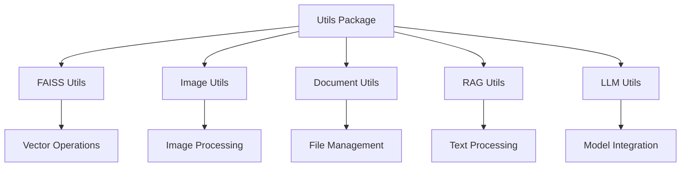

# Utils Documentation

This document details the utility functions and support components used throughout the Atlantium RAG system. For system overview, see our [Technical Reference](technical-reference.md).

## Overview

The utils package provides core functionality for:
- Document processing and extraction
- Image handling and analysis
- Vector operations and embeddings
- System maintenance and updates

## Component Architecture



## Core Components

### 1. FAISS Utils (`FAISS_utils.py`)

Manages vector storage and retrieval. For integration details, see our [Models Documentation](models.md#integration-points).

```python
def initialize_faiss_index(
    dimension: int,
    use_gpu: bool = False
) -> faiss.Index:
    """Initialize FAISS index with GPU support."""
    if use_gpu and faiss.get_num_gpus() > 0:
        gpu_resource = _get_gpu_resources()
        return _cpu_to_gpu(gpu_resource, 0, faiss.IndexFlatL2(dimension))
    return faiss.IndexFlatL2(dimension)

def add_to_faiss(
    embedding: np.ndarray,
    source_file_name: str,
    content_type: str,
    content: Dict,
    index: faiss.Index,
    metadata: List[Dict]
) -> bool:
    """Add embedding to FAISS index."""
    
def query_with_context(
    index: faiss.Index,
    metadata: List[Dict],
    model: Any,
    processor: Any,
    query_text: Optional[str] = None,
    image_query: Optional[Image.Image] = None,
    top_k: int = 5
) -> List[Dict]:
    """Query FAISS index with text or image."""
```

### 2. Image Utils (`image_utils.py`)

Handles image processing and analysis. For web interface integration, see our [Frontend Documentation](frontend.md#image-handling).

```python
def zero_shot_classification(
    image: Union[Image.Image, str],
    labels: List[str],
    model: Any,
    processor: Any,
    device: str
) -> Tuple[str, float]:
    """Classify images using CLIP."""
    
def deduplicate_images(
    images: List[Dict],
    max_images: int = 8
) -> List[Dict]:
    """Remove duplicate images using perceptual hashing."""
    
def normalize_and_hash_image(
    image_data: str,
    target_size: Tuple[int, int] = (224, 224)
) -> Tuple[str, Tuple[int, int]]:
    """Normalize image size and calculate hash."""
```

### 3. Document Utils (`document_utils.py`)

Manages document operations. For update procedures, see our [Update Service Guide](update-service.md).

```python
def rescan_documents(config: CONFIG) -> tuple[bool, str]:
    """Rescan and process new documents."""
    
def remove_document_from_rag(doc_path: Path) -> tuple[bool, str]:
    """Remove document and update indexes."""
    
def create_folder(
    parent_path: Path,
    folder_name: str
) -> tuple[bool, str]:
    """Create new document folder."""
```

### 4. RAG Utils (`RAG_utils.py`)

Core RAG functionality for document processing.

```python
def extract_text_and_images_from_pdf(pdf_path: str) -> Tuple[str, List[Dict]]:
    """Extract content from PDF files."""
    
def extract_text_and_images_from_word(doc_path: str) -> Tuple[str, List[Dict]]:
    """Extract content from Word documents."""
    
def extract_text_and_images_from_excel(excel_path: str) -> Tuple[str, List[Dict]]:
    """Extract content from Excel files."""
    
def chunk_text(
    text: str,
    source_path: str,
    chunk_size: int = CONFIG.CHUNK_SIZE
) -> List[Dict]:
    """Split text into processable chunks."""
```

### 5. LLM Utils (`LLM_utils.py`)

Model integration helpers. For model details, see our [Models Documentation](models.md).

```python
def CLIP_init(model_name: str = "openai/clip-vit-base-patch32") -> Tuple[Model, Processor, str]:
    """Initialize CLIP model and processor."""
    
def encode_with_clip(
    texts: List[str],
    images: List[Image.Image],
    model: Any,
    processor: Any,
    device: str
) -> Tuple[np.ndarray, np.ndarray]:
    """Generate embeddings for text and images."""
    
def openai_post_request(
    messages: List[Dict],
    model_name: str,
    max_tokens: int,
    temperature: float,
    api_key: str
) -> Dict:
    """Send request to OpenAI API."""
```

## Usage Examples

### 1. Document Processing
```python
from utils.RAG_utils import extract_text_and_images_from_pdf

# Process PDF document
text, images = extract_text_and_images_from_pdf('document.pdf')

# Split into chunks
chunks = chunk_text(text, 'document.pdf')
```

### 2. Vector Operations
```python
from utils.FAISS_utils import initialize_faiss_index, add_to_faiss

# Initialize index
index = initialize_faiss_index(dimension=512, use_gpu=True)

# Add embeddings
for embedding, metadata in embeddings:
    add_to_faiss(embedding, source_file, 'text-chunk', metadata, index)
```

### 3. Image Processing
```python
from utils.image_utils import deduplicate_images, zero_shot_classification

# Remove duplicate images
unique_images = deduplicate_images(images)

# Classify images
label, confidence = zero_shot_classification(
    image,
    labels=['technical', 'non-technical'],
    model=clip_model,
    processor=clip_processor,
    device='cuda'
)
```

## Best Practices

### 1. Document Processing
- Validate file formats before processing
- Handle large files in chunks
- Maintain proper error logging

### 2. Image Management
- Check image quality before processing
- Handle various formats appropriately
- Implement caching for performance

### 3. Vector Operations
- Use appropriate batch sizes
- Implement proper cleanup
- Handle out-of-memory scenarios

## Error Handling

### Common Issues and Solutions

1. Memory Management
```python
def handle_large_file(file_path: str) -> None:
    """Process large files in chunks."""
    try:
        with open(file_path, 'rb') as f:
            while chunk := f.read(8192):
                process_chunk(chunk)
    except MemoryError:
        logger.error("Memory limit reached")
        gc.collect()
```

2. File Format Handling
```python
def validate_file_format(file_path: str) -> bool:
    """Validate file format before processing."""
    try:
        extension = file_path.suffix.lower()
        return extension in CONFIG.SUPPORTED_EXTENSIONS
    except Exception as e:
        logger.error(f"Format validation error: {e}")
        return False
```

3. Network Timeouts
```python
def retry_with_backoff(func, max_retries: int = 3):
    """Retry function with exponential backoff."""
    for attempt in range(max_retries):
        try:
            return func()
        except Exception as e:
            if attempt == max_retries - 1:
                raise
            time.sleep(2 ** attempt)
```

## Performance Optimization

### 1. Batch Processing
```python
def process_in_batches(items: List[Any], batch_size: int = 32):
    """Process items in batches."""
    for i in range(0, len(items), batch_size):
        batch = items[i:i + batch_size]
        process_batch(batch)
```

### 2. Caching
```python
@lru_cache(maxsize=100)
def get_image_embedding(image_id: str) -> np.ndarray:
    """Cache image embeddings."""
    return generate_embedding(load_image(image_id))
```

## Related Documentation

- [Technical Reference](technical-reference.md) - System architecture
- [Models Documentation](models.md) - AI components
- [Frontend Documentation](frontend.md) - Web interface
- [Installation Guide](installation.md) - Setup instructions
- [Update Service](update-service.md) - System updates

## Support

For utility-related issues:
1. Check system logs for errors
2. Verify file permissions
3. Ensure proper dependencies
4. Contact [support](mailto:mikek@atlantium.com)